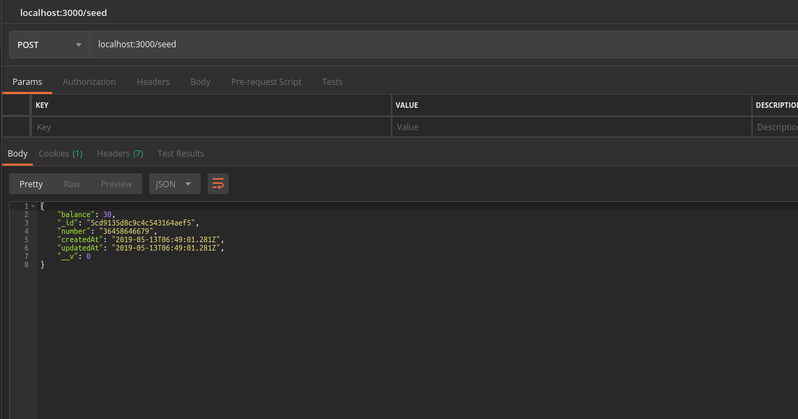
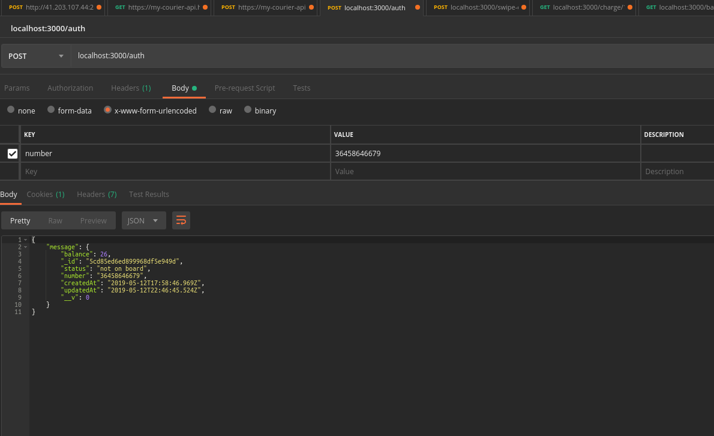
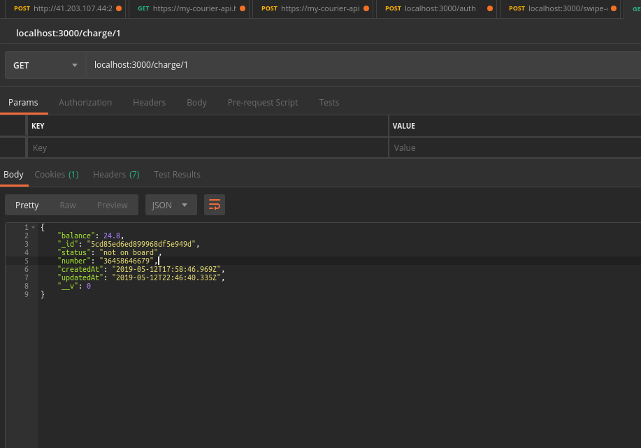
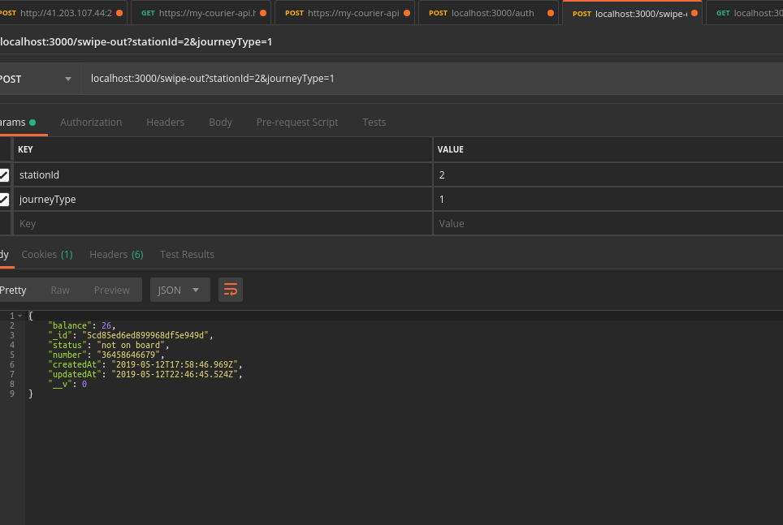
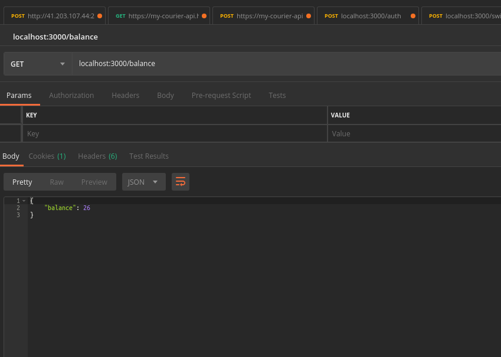

# Subway System API
> An API that models the Newyork's Subway Card System

An API that models the Newyork's Subway Card System

## Installation
Download the project file and extract

## Development Setup
After Installation,
cd subway-system,
npm install,
start mongodb server,
seed passenger data,
sign in with passenger number,
charge passenger,
swipe-out,
view balance,

## Usage
#Seed Passenger data: 
Creates just one passenger data in the database

#Sign in with passenger number: 
Supply the new passenger number for authentication

#Charge passenger: 
charges the passenger account based on transport criteria

#Swipe-out: 
eventually refunds the previously charged amount then deducts the actual cost of the transport

#View balance: 
view balance of passenger

